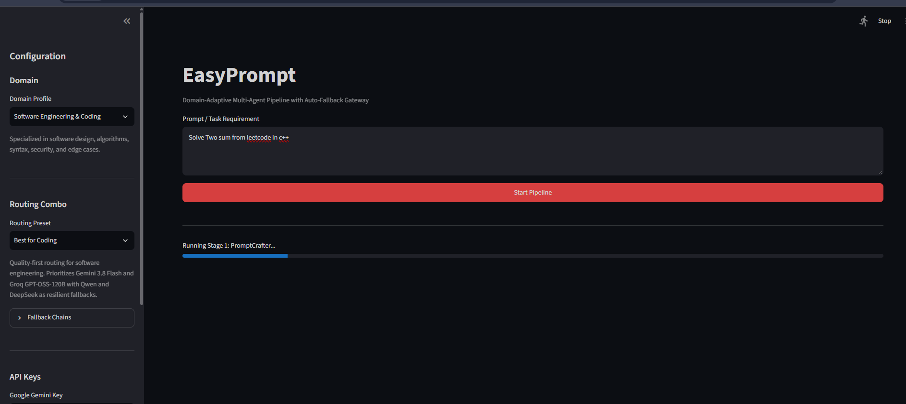
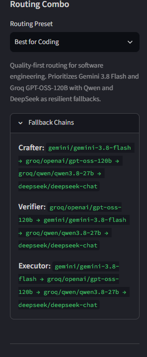
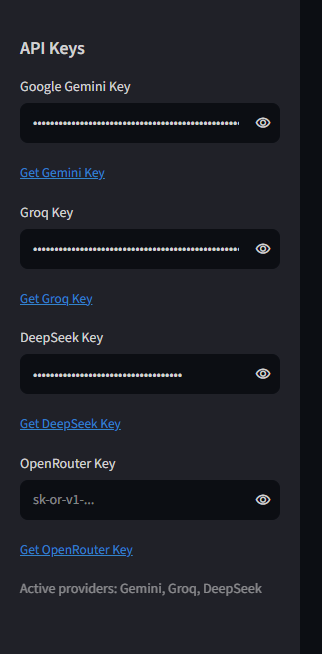
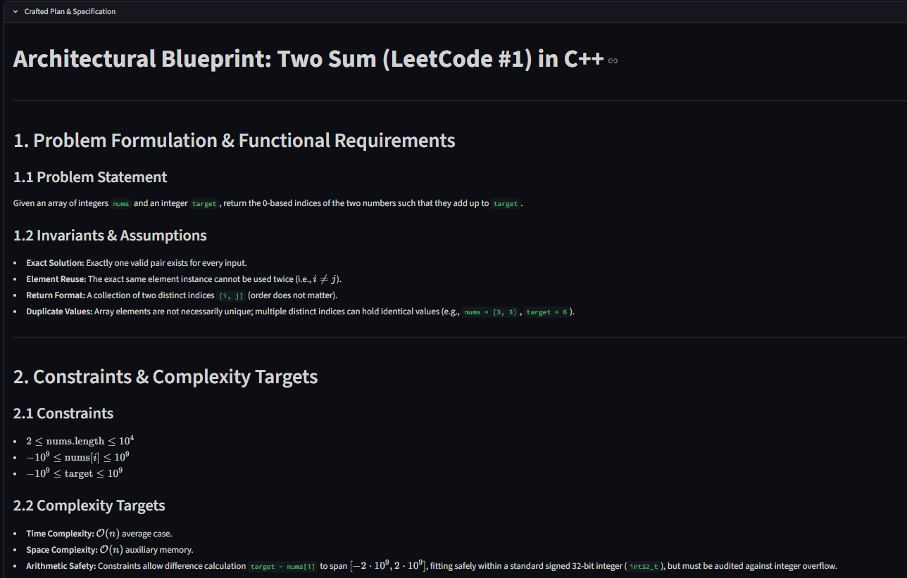
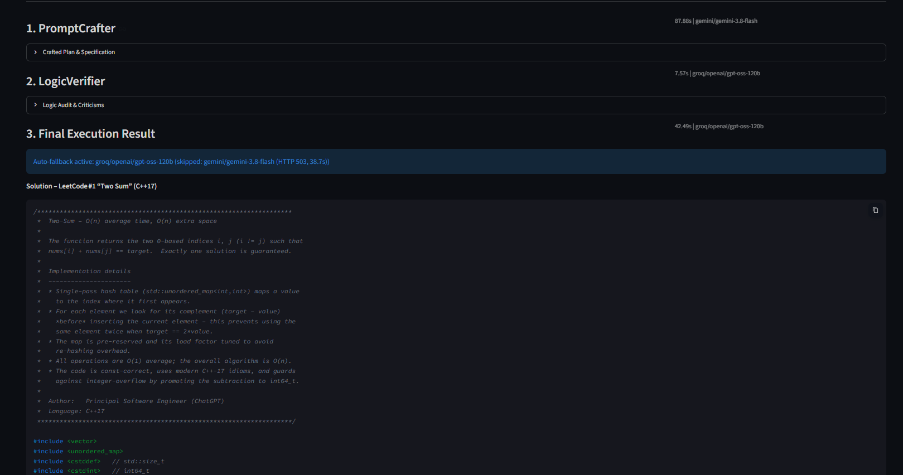
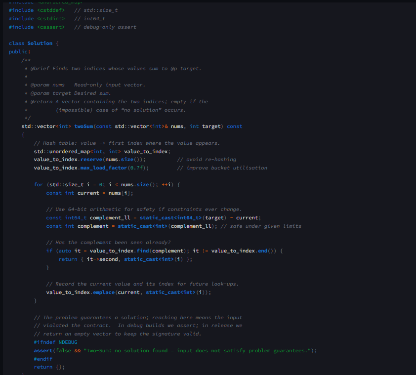
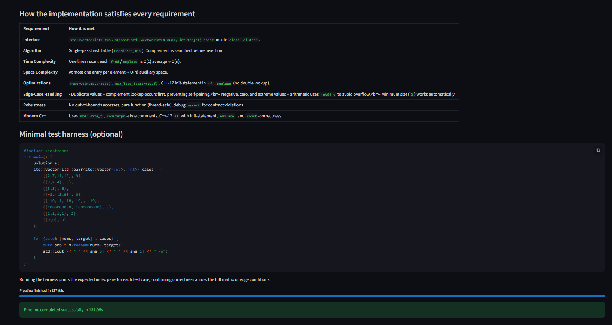
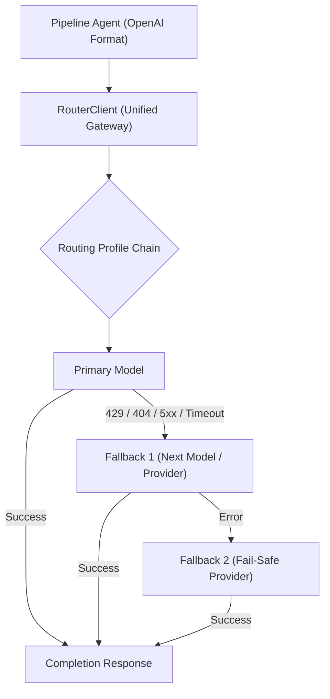

# 🧠 EasyPrompt

> **Domain-Adaptive Multi-Agent Pipeline with Resilient Auto-Fallback Gateway**

[](https://www.python.org/)
[](https://streamlit.io/)
[](https://platform.openai.com/docs/api-reference)

EasyPrompt is a modular multi-agent orchestrator that splits complex problem-solving into a structured, three-stage pipeline (**PromptCrafter** ➔ **LogicVerifier** ➔ **Executor**). Each stage dynamically adapts its system personas and evaluation criteria based on the selected **Domain Profile** (Coding, Mathematics, Creative Writing, or General Reasoning).

To ensure zero downtime, EasyPrompt integrates an **OmniRoute-inspired Unified Gateway** that connects to Google Gemini, Groq, DeepSeek, and OpenRouter through a standardized protocol with **automatic multi-provider fallback** on rate limits (`429`), missing models (`404`), or server errors (`5xx`).

---

## 🌟 Key Features

- **Sequential Multi-Agent Pipeline**: Deconstructs user requests into structured stages:
  1. **PromptCrafter**: Analyzes requirements and crafts an exhaustive technical plan and specification.
  2. **LogicVerifier**: Audits the plan for logical flaws, edge cases, algorithmic complexity (Big O), or security vulnerabilities.
  3. **Executor**: Synthesizes the verified specification and critique into clean, production-ready solutions.
- **Domain-Adaptive Personas**: System instructions and review criteria adapt dynamically to the domain without hardcoded logic (`coding`, `math`, `creative_writing`, `general`).
- **Resilient Auto-Fallback Gateway**: Unified `RouterClient` wrapping Gemini, Groq, DeepSeek, and OpenRouter. If a model encounters a rate limit (`429`), deprecation (`404`), or server outage (`5xx`), it seamlessly switches to the next fallback model in the chain.
- **Routing Combos (Presets)**: Curated routing profiles designed for specific objectives:
  - `Best for Coding` (`coding_pro`)
  - `Ultra Fast / Low Latency` (`fast_throughput`)
  - `Free Tier Optimized` (`free_tier`)
  - `Balanced Reasoning` (`balanced`)
  - `Deep Reasoning & Analysis` (`deep_reasoning`)
- **Dual Interface**:
  - **Interactive Web UI (Streamlit)**: Live stage-by-stage progressive streaming, expandable intermediate reasoning, dynamic API key configuration, and fallback telemetry badges.
  - **Rich CLI**: Clean terminal interface with formatted tables, execution metrics, and progress logs.

---

## 📸 Screenshots & Demo

### 1. Main Interface & Task Input
Configure domain profiles, routing presets, and start execution with live status updates:



### 2. Configuration & Fallback Chains
Inspect fallback chains and manage API keys dynamically in the sidebar:

| Fallback Chains Inspection | Active Provider API Keys |
| :---: | :---: |
|  |  |

### 3. Stage 1 — PromptCrafter Specification
The first agent generates a deep architectural blueprint, edge case considerations, and complexity targets:



### 4. Resilient Auto-Fallback in Action
When Gemini returned an `HTTP 503` error, the gateway automatically recovered and switched to Groq without pipeline interruption:



### 5. Stage 3 — Production Solution & Verification Matrix
The Executor synthesizes the final solution, complete with a requirement fulfillment matrix and test harness:





---

## 📐 Architecture & Workflow

### Multi-Agent Pipeline Flow


### Auto-Fallback Routing Gateway



---

## 📂 Project Structure

```text
EasyPrompt/
├── agents/                     # Agent implementations & factory
│   ├── __init__.py
│   ├── base_agent.py           # BaseAgent abstract class & AgentResponse model
│   ├── factory.py              # AgentFactory (injects domain personas & model chains)
│   ├── prompt_crafter.py       # Stage 1: Requirements analysis & specification crafter
│   ├── logic_verifier.py       # Stage 2: Logical audit, security & edge case critic
│   └── executor.py             # Stage 3: Final solution synthesis & code generation
├── core/                       # Gateway & infrastructure layer
│   ├── __init__.py
│   ├── combos.py               # Routing profiles & fallback chains (ROUTING_PROFILES)
│   ├── config.py               # Environment configuration & settings (.env loader)
│   ├── llm_clients.py          # Standalone client wrappers for individual SDKs
│   └── router.py               # RouterClient: OpenAI-compatible gateway with auto-fallback
├── domain/                     # Domain profile definitions
│   ├── __init__.py
│   ├── profiles.py             # DomainProfile definitions (prompts, personas, criteria)
│   └── prompts/                # Modular domain prompt packages
├── orchestrator/               # Pipeline execution engine
│   ├── __init__.py
│   └── pipeline.py             # AgentPipeline (CLI runner & generator for progressive UI)
├── .env.example                # Example environment variable file
├── .gitignore                  # Git ignore rules
├── main.py                     # Rich CLI entry point
├── requirements.txt            # Python dependencies
├── ui_app.py                   # Streamlit Web UI application
└── README.md                   # Project documentation
```

---

## 🔌 Supported Providers & Models

EasyPrompt connects to any OpenAI-compatible endpoint. Out of the box, it provides configured adapters for:

| Provider | Base URL | Typical Models | Characteristics |
|---|---|---|---|
| **Google Gemini** | `https://generativelanguage.googleapis.com/v1beta/openai/` | `gemini-3.8-flash`, `gemini-2.0-flash` | High context window, fast multimodal reasoning |
| **Groq** | `https://api.groq.com/openai/v1` | `openai/gpt-oss-120b`, `openai/gpt-oss-20b`, `qwen/qwen3.8-27b`, `llama-3.3-70b-versatile` | Ultra-fast LPU inference, ideal for critical pipelines |
| **DeepSeek** | `https://api.deepseek.com` | `deepseek-chat`, `deepseek-reasoner` | Exceptional mathematical & algorithmic reasoning |
| **OpenRouter** | `https://openrouter.ai/api/v1` | `anthropic/claude-3.5-sonnet`, `meta-llama/llama-3.3-70b-instruct:free` | Aggregator for premium and free-tier open models |

---

## ⚡ Routing Combos (Presets)

Routing presets define the fallback chain for each stage of the pipeline:

| Combo ID | Display Name | Best For | Model Fallback Chain (Crafter / Verifier / Executor) |
|---|---|---|---|
| `coding_pro` | Best for Coding | Software engineering & architecture | Gemini 3.8 Flash ➔ Groq GPT-OSS-120B ➔ Groq Qwen 27B ➔ DeepSeek Chat |
| `fast_throughput` | Ultra Fast / Low Latency | Rapid iteration & high throughput | Groq GPT-OSS-120B ➔ Groq GPT-OSS-20B ➔ Gemini 3.8 Flash |
| `free_tier` | Free Tier Optimized | Cost minimization & generous free tiers | Groq GPT-OSS-120B ➔ Gemini 3.8 Flash ➔ OpenRouter Free models |
| `balanced` | Balanced Reasoning | General problem solving | Gemini 3.8 Flash ➔ Groq GPT-OSS-120B ➔ DeepSeek Chat |
| `deep_reasoning` | Deep Reasoning & Analysis | Math proofs, algorithmic verification | Groq GPT-OSS-120B ➔ Gemini 3.8 Flash ➔ DeepSeek Reasoner |

---

## 🎯 Domain Profiles

Domain profiles adapt each agent's system prompt to enforce domain-specific constraints:

- **`coding` (Software Engineering & Coding)**:
  - *Crafter*: Defines technical requirements, data structures, performance constraints, and edge cases.
  - *Verifier*: Reviews time/space complexity (Big O), edge cases, security vulnerabilities, and code safety.
  - *Executor*: Writes clean, idiomatic, fully functional, production-ready code.
- **`math` (Mathematics & Analytical Problem Solving)**:
  - *Crafter*: Formalizes hypotheses, identifies required theorems/formulas, outlines step-by-step derivations.
  - *Verifier*: Rigorously verifies arithmetic, proofs, boundary conditions, and division-by-zero risks.
  - *Executor*: Produces fully justified, step-by-step mathematical solutions.
- **`creative_writing` (Creative Writing & Storytelling)**:
  - *Crafter*: Deconstructs themes, pacing, tone, and character arcs.
  - *Verifier*: Evaluates narrative consistency, emotional resonance, clichés, and character motivations.
  - *Executor*: Composes rich, evocative prose implementing the editorial guidance.
- **`general` (General Knowledge & Reasoning)**:
  - *Crafter*: Deconstructs complex queries into structured analytical components.
  - *Verifier*: Audits factual soundness, potential biases, and logical coherence.
  - *Executor*: Synthesizes a comprehensive, clear, and actionable final answer.

---

## 🚀 Getting Started

### 1. Prerequisites

- Python 3.10 or higher
- At least one API key from any supported provider (e.g. Gemini, Groq, DeepSeek, or OpenRouter)

### 2. Installation

Clone the repository and install the dependencies:

```bash
git clone https://github.com/TudorvCampean/EasyPrompt.git
cd EasyPrompt

# Create and activate virtual environment
python3 -m venv .venv
source .venv/bin/activate  # On Windows: .venv\Scripts\activate

# Install required packages
pip install -r requirements.txt
```

### 3. Configure API Keys

Create a `.env` file based on [.env.example](file:///.env.example):

```bash
cp .env.example .env
```

Edit `.env` and add your available API keys:

```ini
# At least one key is required; configure multiple for auto-fallback resilience
GEMINI_API_KEY=your_gemini_api_key_here
GROQ_API_KEY=your_groq_api_key_here
DEEPSEEK_API_KEY=your_deepseek_api_key_here
OPENROUTER_API_KEY=your_openrouter_api_key_here
```

> **Tip**: You only need keys for the providers you wish to use. Models requiring unconfigured keys will be automatically bypassed in the fallback chain.

---

## 🖥️ Usage

### Web Interface (Streamlit)

Launch the interactive web UI:

```bash
streamlit run ui_app.py
```

Features:
- Select Domain Profile and Routing Preset directly from the sidebar.
- Inspect fallback chains and customize API keys in real time.
- Watch progress update as each agent completes its stage.
- Expand/collapse intermediate plans, audits, and criticisms.
- Live fallback indicators displaying provider failover details.

### Command Line Interface (CLI)

Run the interactive Rich CLI:

```bash
python main.py
```

The CLI guides you through:
1. Selecting a Domain Profile (e.g., `coding`, `math`, `creative_writing`, `general`).
2. Selecting a Routing Combo (e.g., `coding_pro`, `fast_throughput`, `balanced`).
3. Entering your task description.
4. Streaming stage timings and displaying the final formatted output in the terminal.

### Programmatic Python Usage

You can also use EasyPrompt as a library in your own Python projects:

```python
from core.config import settings
from core.router import RouterClient
from core.combos import get_routing_profile
from domain.profiles import get_domain_profile
from agents.factory import AgentFactory
from orchestrator.pipeline import AgentPipeline

# 1. Initialize the unified RouterClient
router = RouterClient(api_keys={
    "gemini": settings.gemini_api_key,
    "groq": settings.groq_api_key,
    "deepseek": settings.deepseek_api_key,
    "openrouter": settings.openrouter_api_key,
})

# 2. Select domain profile and routing combo
domain = get_domain_profile("coding")
combo = get_routing_profile("coding_pro")

# 3. Instantiate domain-specific agents
crafter, verifier, executor = AgentFactory.create_pipeline_agents(
    domain_profile=domain,
    router=router,
    routing_profile=combo,
)

# 4. Build and execute pipeline
pipeline = AgentPipeline(
    domain_key=domain.key,
    routing_profile_id=combo.id,
    crafter=crafter,
    verifier=verifier,
    executor=executor,
)

result = pipeline.run("Implement an asynchronous LRU cache with TTL in Python.")
print(result.executor_response.content)
```

---

## 🧩 Extending EasyPrompt

### Adding a New Domain Profile

Add a new `DomainProfile` entry to `DOMAIN_PROFILES` in [domain/profiles.py](file:///domain/profiles.py):

```python
"data_science": DomainProfile(
    key="data_science",
    display_name="Data Science & ML Engineering",
    description="Specialized in data preprocessing, model selection, evaluation metrics, and leakage prevention.",
    crafter_system_prompt="You are a Lead Data Scientist...",
    verifier_system_prompt="You are an ML QA Auditor...",
    executor_system_prompt="You are a Principal MLOps Engineer...",
)
```

### Adding a New Routing Preset

Add a new `RoutingProfile` entry to `ROUTING_PROFILES` in [core/combos.py](file:///core/combos.py):

```python
"custom_combo": RoutingProfile(
    id="custom_combo",
    name="My Custom Chain",
    description="Custom fallback routing strategy.",
    crafter_chain=["gemini/gemini-3.8-flash", "groq/openai/gpt-oss-120b"],
    verifier_chain=["groq/openai/gpt-oss-120b", "gemini/gemini-3.8-flash"],
    executor_chain=["gemini/gemini-3.8-flash", "deepseek/deepseek-chat"],
)
```

---

## ⚠️ Disclaimer

<!-- Write your disclaimer here -->
